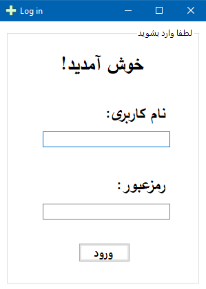
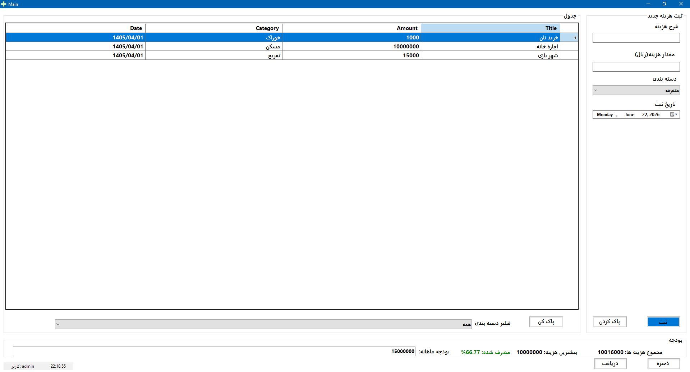

# PersonalExpenseManager

### معرفی پروژه

این پروژه یک نرم‌افزار مدیریت هزینه‌های شخصی است که با استفاده از زبان C# و Windows Forms توسعه داده شده است.

هدف از ساخت این پروژه تمرین مفاهیم برنامه‌نویسی شی‌گرا، کار با فرم‌ها، مدیریت داده‌ها و ذخیره‌سازی اطلاعات در فایل بوده است.

### Login Form

### Main Form

### امکانات برنامه

- ورود کاربر (Login)
- ثبت هزینه جدید
- انتخاب دسته‌بندی هزینه
- ثبت تاریخ هزینه
- نمایش اطلاعات در DataGridView
- محاسبه مجموع هزینه‌ها
- نمایش بیشترین هزینه ثبت شده
- محاسبه درصد مصرف بودجه
- فیلتر هزینه‌ها بر اساس دسته‌بندی
- حذف هزینه‌ها
- ذخیره اطلاعات در فایل CSV
- بارگذاری اطلاعات از فایل CSV
- نمایش ساعت زنده سیستم
- نمایش نام کاربر در StatusStrip

### تکنولوژی‌های استفاده شده

- C#
- .NET 8
- Windows Forms
- CSV File Handling

### هدف آموزشی

این پروژه به منظور یادگیری مفاهیم زیر توسعه داده شده است:

- برنامه‌نویسی شی‌گرا (OOP)
- کار با List
- مدیریت رویدادها (Events)
- کار با DataGridView
- ذخیره و بازیابی اطلاعات
- طراحی رابط کاربری در WinForms

---
